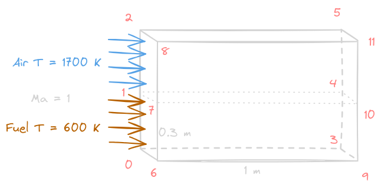

# Burning cases
---
## Condition

- Size: $1 \times 0.3$ m
- Initial: 
    - Fuel: $T_{0} = 600$ K, $Ma = 1$
    - Air: $T_{0} = 1700$ K. $Ma = 1$
- Turbulent Model: LES
- Combustion Model: PaSR
- Solver: reactingFoam

- We Separate the inlet into 2 parts, the upper part is for air, and the lower is for fuel
- The thickness is set to 1mm

- Reference: [PaSR](https://zhuanlan.zhihu.com/p/25066317985)
