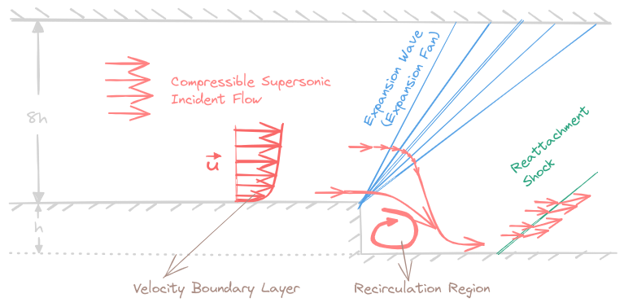
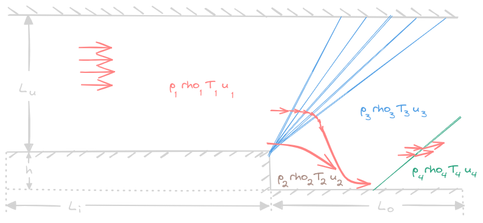
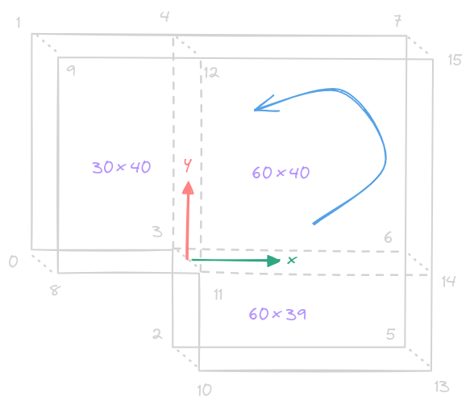
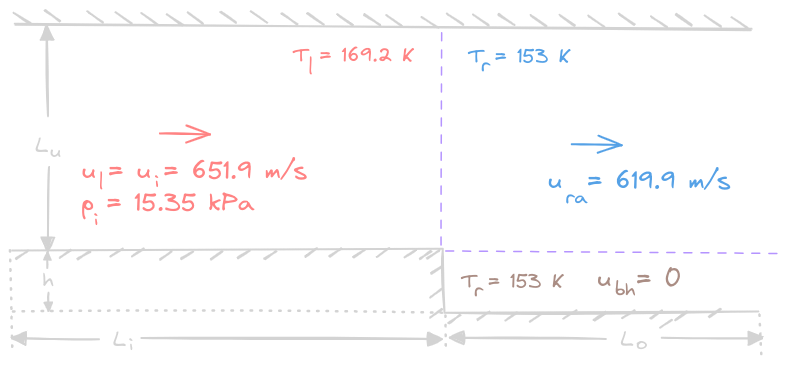
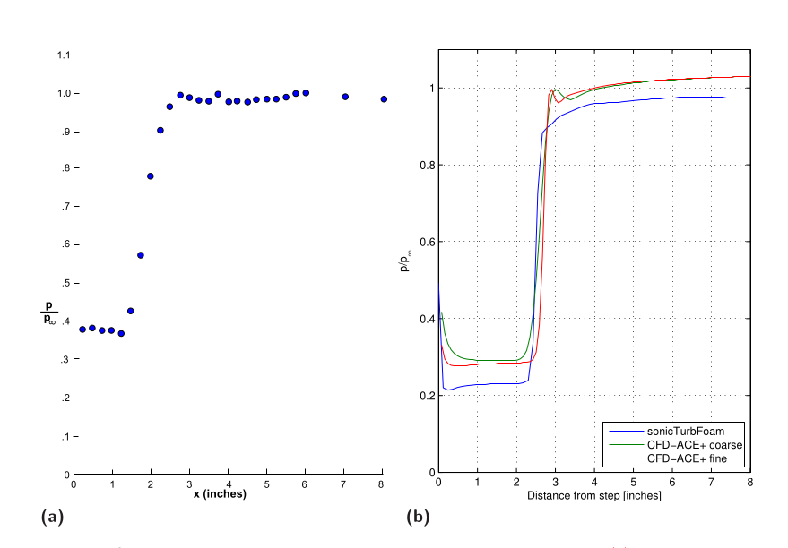

# Backward Facing Step

## Introduction

Backward Facing Step: Compressible supersonic incident flow through a sudden step

    

- Right after the step, an **expansion fan** is formed
- The flow **separates** after the step
- Behind the step, there is a **recirculation area**
- The end of the recirculation area is marked by a weak oblique **reattachment shock**

## Setup

The flow condition divides the tube into **4 parts** but mesh with **3 parts**:

    

Geometry: 
- Height of the step: $h = 11.25$ mm
- Length from inlet to the step: $L_{i} = 0.1016$ m
- Length from the step to the outlet: $L_{o} = 0.3048$ m
- Length from step to the upper boundary: $L_{u} = 0.1475$ m

    

Vertices coordinates (mm):
- (-101.6 0 -0.5), (-101.6 0 0.5) **0+8**
- (-101.6 147.5 -0.5), (-101.6 147.5 0.5) **1+9**
- (0 -11.25 -0.5), (0 -11.25 0.5) **2+10**
- (0 0 -0.5), (0 0 0.5) **3+11**
- (0 147.5 -0.5), (0 147.5 0.5) **4+12**
- (304.8 -11.25 -0.5), (304.8 -11.25 0.5) **5+13**
- (304.8 0 -0.5), (304.8 0 0.5) **6+14**
- (304.8 147.5 -0.5), (304.8 147.5 0.5) **7+15**

Meshing: 
- Volumes above the step: $30\times 40$
- Volumes to the right of and above the step: $60\times 40$
- Volumes behind the step: $60\times 39$

    

Initialization:
- Inflow Mach number: $Ma_{i} = 2.5$ 
- Static inflow pressure: $p_{i} = 15.35$ kPa 
- Temperature to the left of the step: $T_{l} = 169.2$ K
- Temperature to the right of the step: $T_{r} = 153$ K
- Velocity to the left of the step: $u_{l} = u_{i} = 651.9$ m/s
- Velocity to the right of and above the step (for continuous Mach number): $u_{ra} = 619.9$ m/s 
- Velocity behind the step (for proper development of the recirculation region): $u_{bh} = 0$ 

Boundary Condition:
- Zero gradient for $k$ and $\varepsilon$ at all boundaries
- Fixed value of inlet pressure and temperature, zero gradient everywhere
- Fixed value of inlet velocity, **no-slip walls** at the lower boundary, **slip** wall at the upper boundary and zero gradient at the outlet for velocity

For turbulence, the standard $k-\varepsilon$ model is chosen

Dictionary for **thermal physical properties** (based on values for **air** ) :
- Specific heat capacity: $c_{p} = 1005$ J/(kg $\cdot$ K)
- Heat of fusion: $H_{f} = 2.544\times 10^{6}$ J/kg
- Dynamic viscosity: $\mu = 18.27\times 10^{-6}$ kg/(m $\cdot$ s)
- Prandtl number: $\displaystyle \mathrm{Pr} = \frac{c_{p}\mu}{\kappa} = 0.7$
- Thermal conductivity: $\kappa = 0.0262$ W/(m $\cdot$ K)

Dictionary for **fvSchemes** and **equation solvers**, **tolerances** and algorithms in **fvSolution** remain default settings.

## Quality Evaluation:

- Recirculation zone: end at $\approx 2.4 h$
- Pressure relative to the inflow static pressure $p_{\infty} = p_{i}$ after step: 
    - Expansion wave crossed 2 inches
    - value in expansion fan of $\displaystyle \frac{p}{p_{\infty}} = 0.4$
- Improvement: 
    - RNG $k-\varepsilon$ model
    - sutherlandTransport: $$\mu = \frac{A_{s}\sqrt T}{1+T_{s}/T}$$  $A_{s} = 1.452\times 10^{-6}$ kg/(m $\cdot$ s $\cdot$ K $^{1/2}$),  $T_{s} = 120$ K
    - Mesh refinement to 23760 blocks

    

