# Experiment Results for 4.1
---

## Temperature Comparison

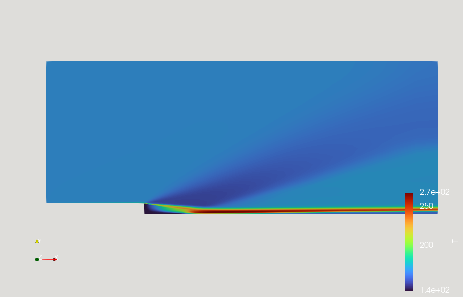 sonicFoam (by agent) 

---

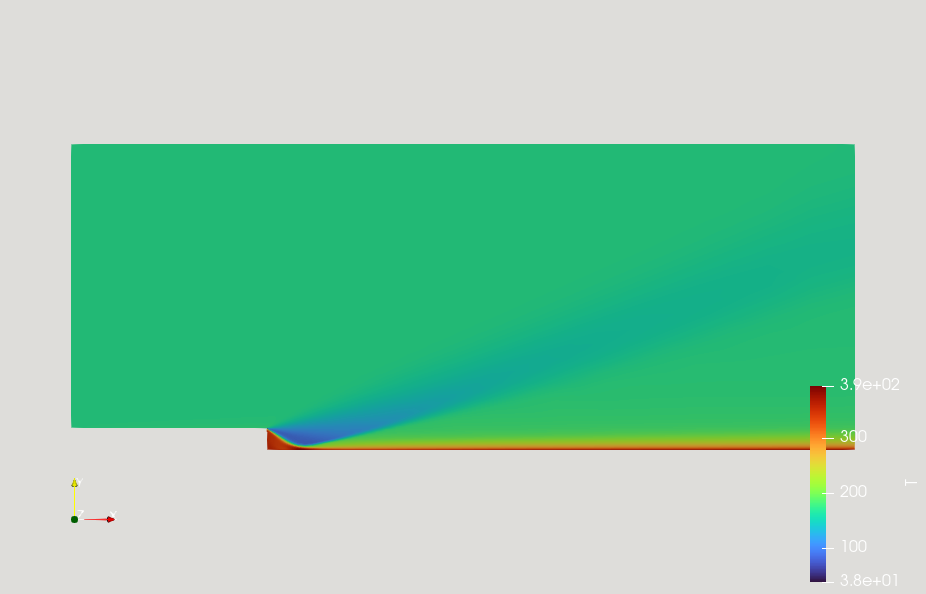 rhoCentralFoam (by agent) 

---

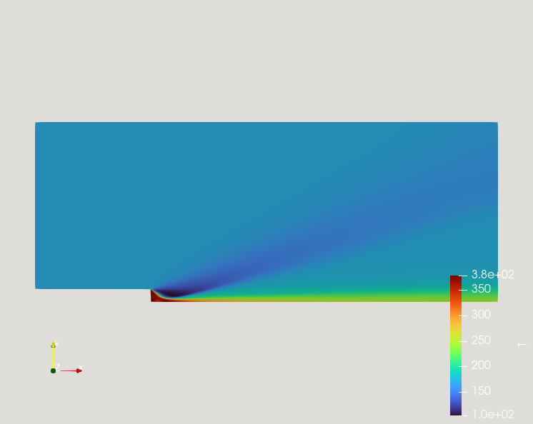 rhoPimpleFoam 

---

## Velocity Comparison

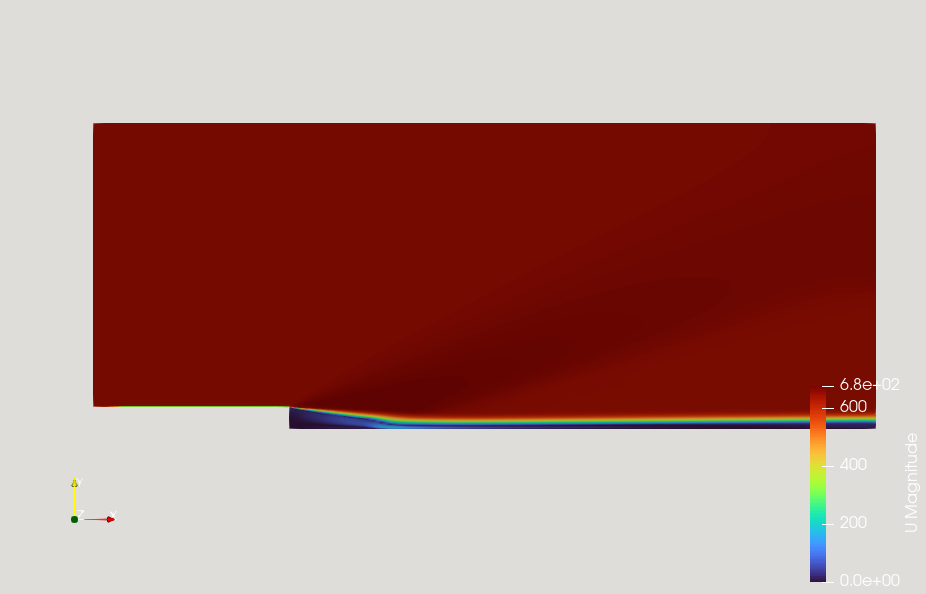 sonicFoam (by agent) 

---

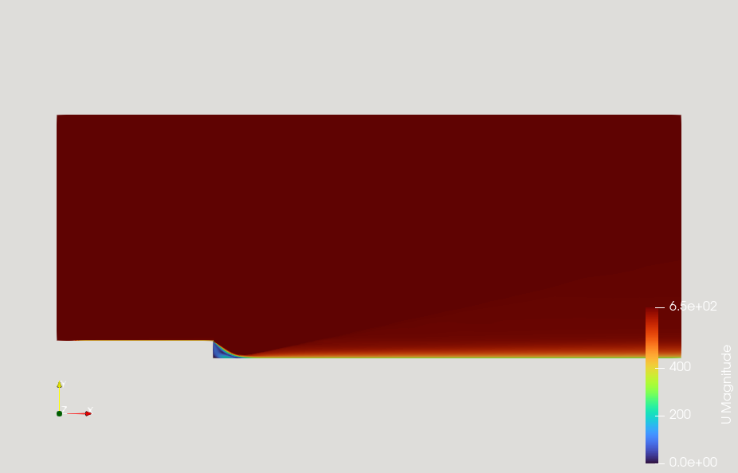 rhoCentralFoam (by agent) 

---

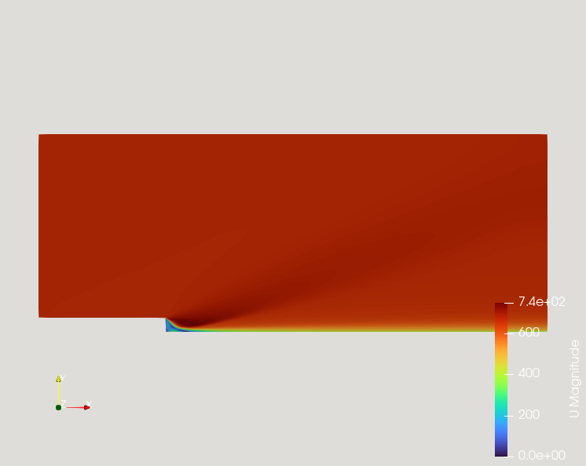 rhoPimpleFoam 

---

## Velocity Comparison (Vector)

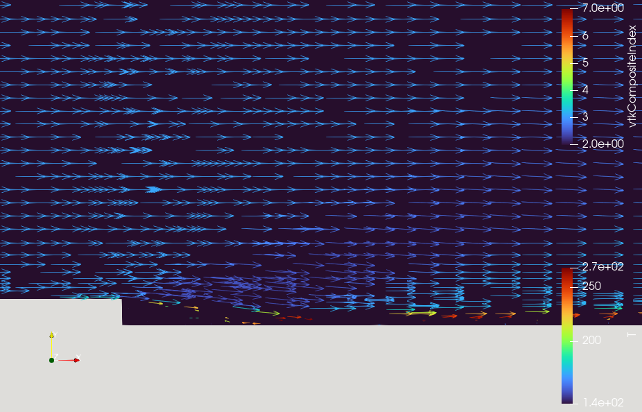 sonicFoam (by agent) 

---

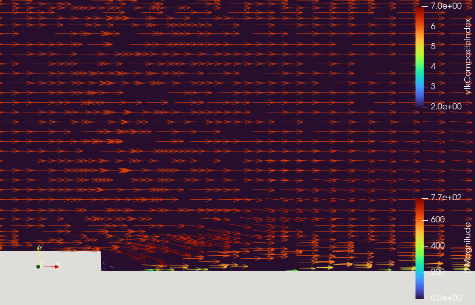 rhoCentralFoam (by agent) 

---

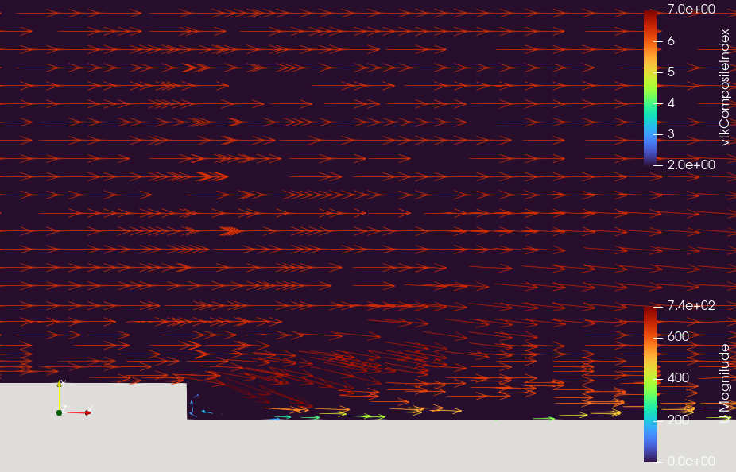 rhoPimpleFoam 

---

## Pressure Comparison

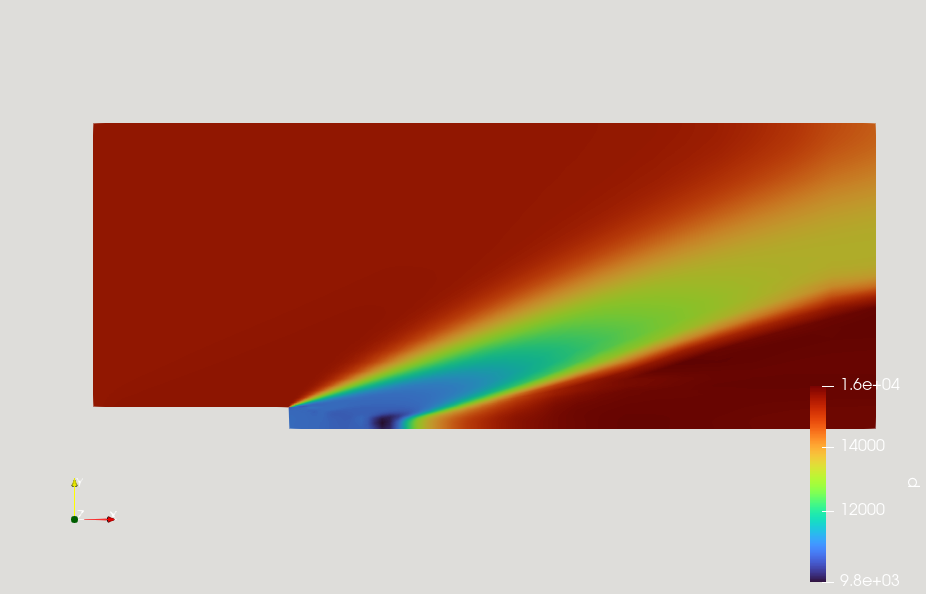 sonicFoam (by agent) 

---

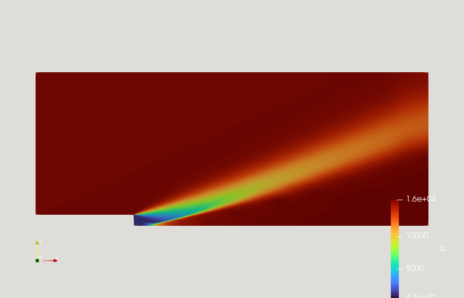 rhoCentralFoam (by agent) 

---

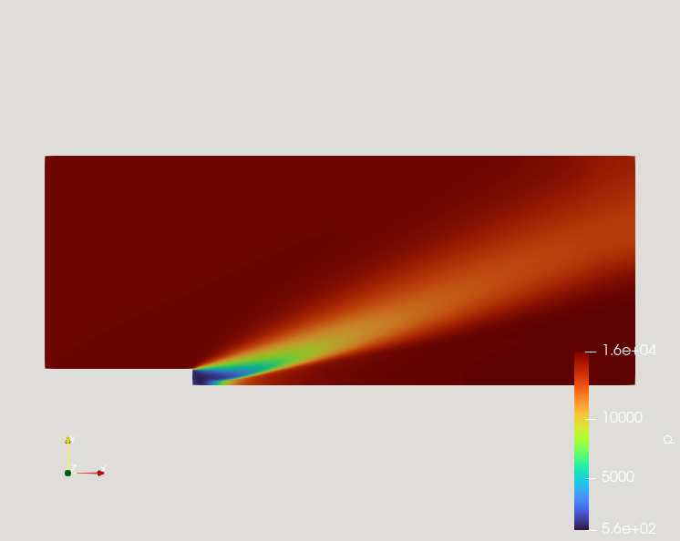 rhoPimpleFoam 

---

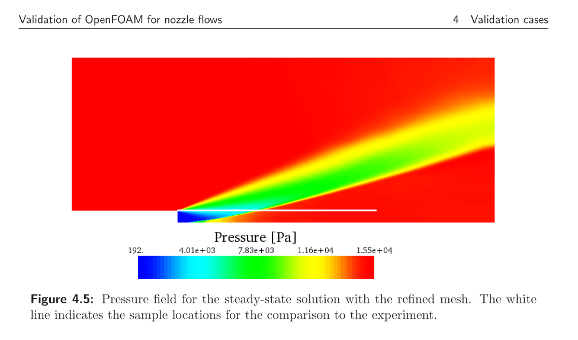 paper 

---

## Total Pressure Data Comparison (Graph)

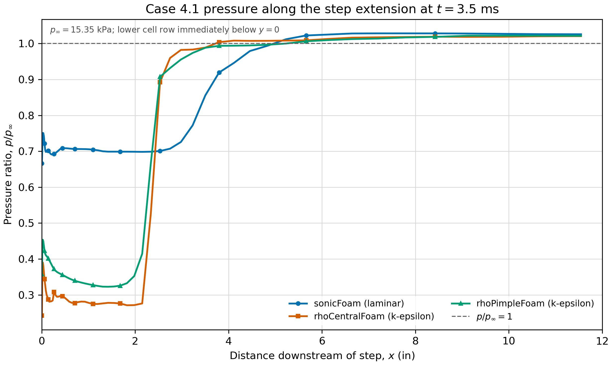 3 solvers (by agent) 

---

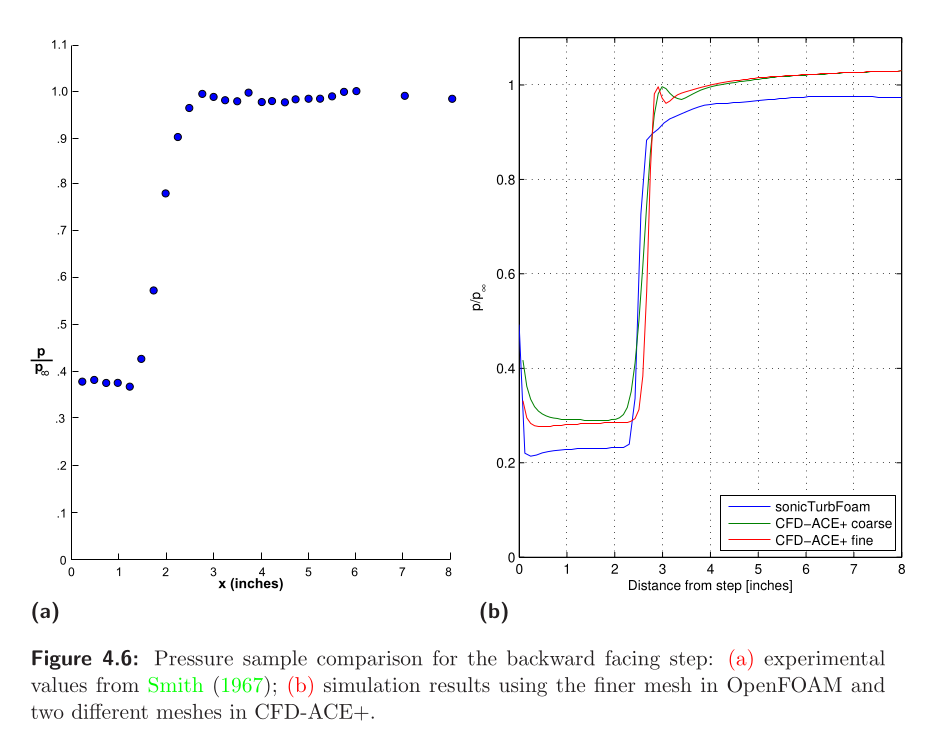 paper 

---

